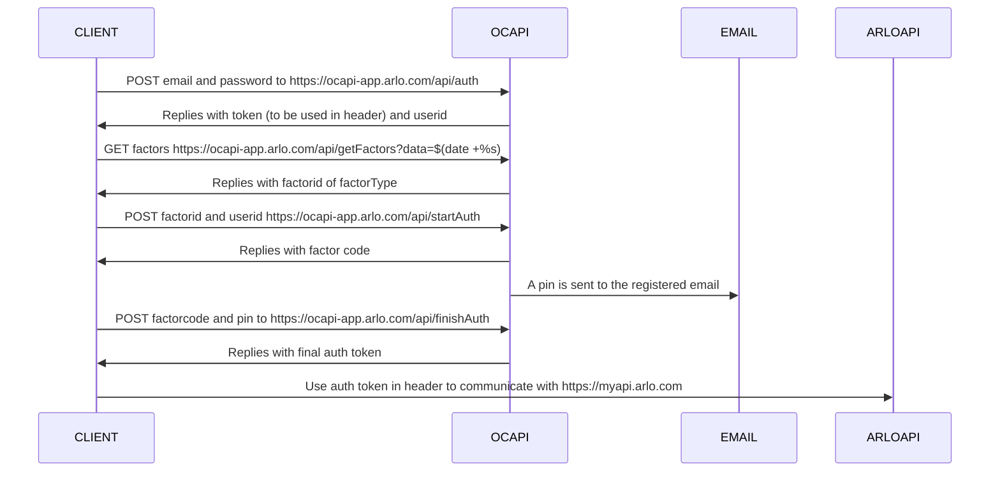

# Node api integration for arlo

Purpose of this project is to enable communication with ARLO cameras and the ARLO cloud.
A process for handling the ARLO MFA is automated based on email.

State of the project:

- [x] MFA automation
- [x] Basic communication with ARLO
- [x] Subscribe to events
- [x] Get devices
- [x] Arm/Disarm device
- [ ] Map more API functionality
- [ ] Improve error handling
- [ ] Add test
- [ ] Add better debug


## Usage

To reliably refresh the session tokens every 14 days, I recomend creating a free outlook email and granting that email access under "Settings->Grant Access". Make sure to activate the new user, login and enable email MFA.

Example interaction:
```
import arlo from './arlo/arlo.mjs'

const Arlo = new arlo(
  'arlouser@outlook.com',
  'arlopassword',
  'arlouser@outlook.com',
  'emailpassword',
  'imap-mail.outlook.com'
);

Arlo.getDevices();   
```

Once logged in the session is stored in the `sessions` folder until it automatically renews upon expiry.


## login process with 2FA

Arlo requires 2Factor authentication for logins. Below is a diagram of the process

